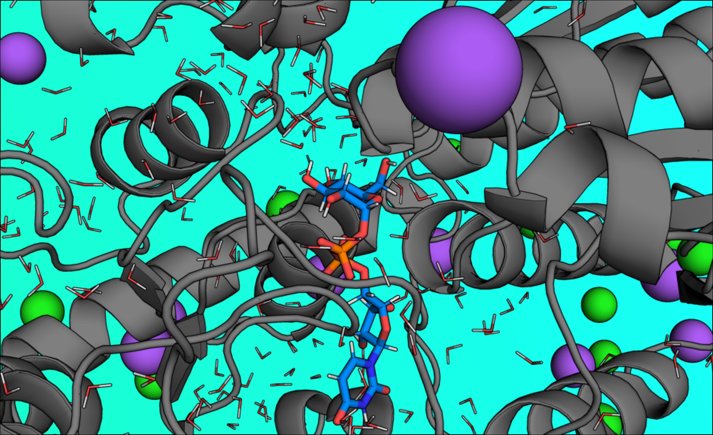

<style>
body { text-align: justify; }
</style>

```{r,out.width="95%",fig.align='center', echo=FALSE}

```

```{r, echo=FALSE, out.width="60%", fig.align='center'}
# Banner opcional: el post se teje igual aunque no exista la imagen.
img <- "breve_historia_qc.png"
if (file.exists(img)) knitr::include_graphics(img)
```

La química computacional es, en esencia, hacer química con matemáticas y computadores. Su propósito no es “hacer dibujos bonitos” de moléculas, sino calcular propiedades moleculares (energías, geometrías, espectros, cargas, barreras de reacción) o simular el comportamiento molecular (cómo se mueven los átomos, cómo se estabiliza un complejo, cómo progresa una reacción). Esa definición, curiosamente sobria, es muy parecida a la de IUPAC: una disciplina que usa métodos matemáticos para calcular propiedades o simular el comportamiento molecular (ver la entrada “Computational chemistry” en el Gold Book de IUPAC: https://goldbook.iupac.org/terms/view/C01370). En otras palabras: es una caja de herramientas para responder preguntas químicas cuando el experimento es difícil, caro, peligroso, lento o simplemente no alcanza a ver lo que ocurre a nivel atómico.

Ahora, “computacional” suena a que todo vale, y ahí aparece la confusión. La química computacional no es sinónimo de bioinformática, aunque ambas usen computación. La bioinformática, en la definición de IUPAC, se centra en desarrollar y usar herramientas computacionales para almacenar, analizar e interpretar datos biológicos (por ejemplo, secuencias de genes o proteínas, anotaciones, búsquedas y alineamientos; ver “Bioinformatics” en el Gold Book: https://goldbook.iupac.org/terms/view/B00680). Es más “datos y patrones a gran escala”. La química computacional, en cambio, suele estar más cerca de “modelos físicos y químicos” (electrones, fuerzas, energía, dinámica), aunque hoy convive felizmente con el mundo de datos.

Tampoco es idéntica a la biofísica. La biofísica es un paraguas enorme: la aplicación de principios y métodos de la física para entender sistemas biológicos (por ejemplo, la definición general en Britannica: https://www.britannica.com/science/biophysics). Dentro de la biofísica existe la biofísica computacional, que usa simulaciones (por ejemplo, dinámica molecular) para estudiar movimiento y función de biomoléculas. Ahí hay superposición real: cuando la química computacional se mete en proteínas, membranas o enzimas, muchas veces estás trabajando en esa frontera compartida. La diferencia práctica no es “quién tiene la razón”, sino qué preguntas mandan: si la pregunta es principalmente química (mecanismos, reactividad, enlaces, energía), la brújula apunta a química computacional; si la pregunta es principalmente biológica/física (función, conformaciones, ensamblajes, transporte), suena más a biofísica.

Con esa idea clara, se entiende mejor el resto del viaje: la química computacional no apareció de la nada, sino como el resultado de una cadena de ideas que fueron construyendo el piso. Primero hubo que aceptar que la energía viene en “paquetes”; luego hubo que inventar el lenguaje matemático para describir electrones; después, conectar esa matemática con observables; más tarde, transformar todo eso en reglas químicas sobre enlaces y reactividad; y finalmente, convertirlo en métodos prácticos que escalen desde moléculas pequeñas hasta proteínas completas. Esa escalera intelectual es justamente la que se ve, con una claridad casi cinematográfica, cuando uno mira cronológicamente varios Premios Nobel que, sin proponérselo como “plan maestro”, terminaron cimentando lo que hoy llamamos química computacional.

En lo que sigue, voy a recorrer esa historia usando una guía simple: cada Nobel como un ladrillo, y cada ladrillo como una idea que hoy vive dentro de los cálculos que hacemos en un computador. No para idolatrar premios, sino para mostrar cómo se fue armando el mapa: desde los cuantos de energía, pasando por la mecánica cuántica y la ecuación de Schrödinger, hasta la teoría del funcional de la densidad (DFT, por sus siglas en inglés: Density Functional Theory) y los modelos híbridos mecánica cuántica/mecánica molecular (QM/MM, mecánica cuántica / mecánica molecular), y llegando al presente, donde el diseño y la predicción de estructuras de proteínas aceleran el punto de partida de muchas investigaciones.

## Una línea de tiempo, contada con Nobel (y con química)

En 1918, Max Planck ganó el Premio Nobel en Física por el trabajo relacionado con el descubrimiento de los cuantos de energía. Esto pone la primera piedra: en el mundo microscópico la energía no cambia de forma continua, sino en “paquetes”. Dicho simple: no puedes subir la energía de a poquito como una perilla, sino en saltos discretos. Y esa sola idea ya explica por qué átomos y moléculas tienen niveles de energía definidos. Hoy, cuando usamos computadores para calcular energías, estructuras y propiedades electrónicas, todo eso se apoya en esta base, dentro de lo que se conoce como química cuántica (QC).

En 1932, Werner Heisenberg, también en Física, recibe el Nobel por su aporte a la creación de la mecánica cuántica. Esto es relevante porque una de las formas más influyentes de escribir esa teoría es la formulación matricial: usar matrices (tablas de números) para representar cantidades físicas, con reglas de multiplicación que no siempre “conmutan” (es decir, A·B no necesariamente es igual a B·A). Suena abstracto, pero es extremadamente práctico: el cómputo moderno en química se apoya muchísimo en álgebra lineal, que en el fondo es construir matrices y extraer información de ellas (como energías y estados posibles) a través de operaciones matemáticas bien definidas.

En 1933, Erwin Schrödinger y Paul Dirac ganan el Nobel en Física por nuevas formas productivas de la teoría atómica. Schrödinger introduce la ecuación que gobierna cómo se comportan los electrones en átomos y moléculas, describiéndolos con una función tipo “onda”. En la práctica, gran parte de la química computacional vive intentando resolver esa ecuación (o, siendo honestos, aproximarla de manera inteligente), porque resolverla exactamente para moléculas reales es prácticamente imposible. Dirac, por su parte, fortalece el lenguaje matemático moderno de la mecánica cuántica con herramientas y notación muy usadas (la notación bra-ket, por ejemplo), y además abre la puerta a efectos relativistas importantes cuando hablamos de elementos pesados (cuando los electrones se mueven tan rápido que la relatividad empieza a importar).

En 1954, Max Born y Walther Bothe ganan el Nobel en Física. Born aporta la interpretación estadística de la función de onda: en pocas palabras, conecta la matemática con algo medible. Da el puente entre una fórmula y probabilidades reales. Por ejemplo: si tienes una descripción matemática del electrón, ¿qué significa físicamente? Significa probabilidad de encontrarlo en un lugar u otro. Eso está detrás de conceptos como la densidad electrónica (cuánta “presencia electrónica”, entre comillas, hay en cada zona del espacio). Bothe, en cambio, está más del lado experimental con su método de coincidencia: no es un pilar computacional directo, pero representa el tipo de medición que permite contrastar teoría con realidad y darle músculo a lo que se modela.

En ese mismo año, 1954, Linus Pauling gana el Nobel de Química por su trabajo sobre la naturaleza del enlace químico y su aplicación a estructuras complejas. Esto es fundamental en química en general, pero también lo es para la química computacional: Pauling traduce la física cuántica al idioma químico que usamos todos los días (enlaces, estructura, geometría, ideas que luego se conectan con hibridación, resonancia, electronegatividad, etc.). Y aquí hay un punto clave: en química computacional no basta con sacar números; hay que poder explicar qué significan, y Pauling ayuda a consolidar ese marco conceptual.

En 1966, Robert Mulliken recibe el Nobel de Química por su aporte a enlaces y estructura electrónica mediante orbitales moleculares. Él consolida el lenguaje de los orbitales moleculares, que es una manera de describir cómo se distribuyen los electrones en una molécula. Muchísimos métodos computacionales modernos trabajan con esta idea. Y en lo cotidiano, incluso cuando se habla de “cargas” en átomos, uno de los análisis clásicos que aparece es el tipo Mulliken (las famosas cargas de Mulliken), que nacen en ese contexto de interpretar electrónicamente qué está pasando.

En 1981, Kenichi Fukui y Roald Hoffmann ganan el Nobel de Química por teorías sobre el curso de las reacciones químicas. Ellos ayudan a entender por qué una reacción ocurre de una forma y no de otra. Fukui populariza la idea de mirar los orbitales frontera (los orbitales más relevantes para reaccionar, típicamente los más altos ocupados y los más bajos desocupados). Hoffmann, por otro lado, con reglas de simetría orbital, muestra que algunas reacciones están “permitidas” o “prohibidas” (entre comillas) por cómo encajan los orbitales durante el proceso. Hoy, los cálculos computacionales permiten ver esto y cuantificarlo con mucho más detalle del que se podía soñar cuando estas ideas nacieron.

En 1986, Dudley R. Herschbach, Yuan T. Lee y John C. Polanyi ganan el Nobel de Química por sus contribuciones a la dinámica de procesos químicos elementales. Aquí entra fuerte el factor movimiento: una reacción no es solo un inicio y un fin, es un recorrido. Esto conecta con una idea muy visual y poderosa: la superficie de energía potencial, que puedes imaginar como un paisaje de energía. La molécula “se mueve” por ese paisaje: hay valles, hay colinas, y la barrera energética sería como una montaña que hay que superar. La química computacional usa ese paisaje para estudiar mecanismos, estimar barreras y entender qué caminos son más probables para pasar de reactivos a productos.

En 1992, Rudolph A. Marcus gana el Nobel de Química por la teoría de transferencia electrónica. Esto explica cómo y cuándo un electrón “salta” de un lugar a otro, algo central en electroquímica, en reacciones de óxido-reducción y también en sistemas biológicos. Introduce una idea clave: la energía de reorganización, que es cuánto tiene que “acomodarse” el entorno (por ejemplo el solvente o la estructura alrededor) para que el salto sea favorable. Esto guía cómo se modelan procesos redox en distintos ambientes, desde soluciones hasta proteínas.

En 1998, Walter Kohn y John A. Pople ganan el Nobel de Química. Este sí es el premio más directamente relacionado con lo que hoy se llama química computacional “de manual”. Kohn impulsa la Teoría del Funcional de la Densidad (DFT, por sus siglas en inglés: Density Functional Theory), una estrategia que permite calcular propiedades electrónicas con un equilibrio muy atractivo entre costo computacional y precisión. Pople, por su parte, ayuda a transformar estos cálculos en algo práctico y estandarizable, acelerando el uso de métodos computacionales en química cuántica a través de enfoques y herramientas que se incorporaron a software usado por miles de químicos (Gaussian es el ejemplo más icónico asociado a esa era).

En 2013, Martin Karplus, Michael Levitt y Arieh Warshel ganan el Nobel de Química por modelos multiescala para sistemas complejos. La idea es elegante: no todo un sistema necesita el mismo nivel de detalle. Si piensas en una proteína que cataliza una reacción, no toda la proteína está “reaccionando”; la química ocurre en una zona pequeña. Entonces, ellos consolidan el enfoque de describir esa zona reactiva con mecánica cuántica (la parte donde los electrones importan directamente) y describir el resto del sistema con un modelo más simple y eficiente, típico de mecánica molecular. A esto se le conoce como QM/MM (mecánica cuántica / mecánica molecular). Este tipo de modelos permite simulaciones realistas de enzimas, catálisis, reactividad en solución y otros sistemas donde el entorno es grande e indispensable. Y sí: esto es exactamente el tipo de enfoque que yo uso en mi investigación día a día. Sin embargo, su impacto va mucho más allá de enzimas: también es clave para materiales, interfaces, catálisis heterogénea, reactividad en solventes complejos y electroquímica, entre otros.

Finalmente, en 2024, David Baker, Demis Hassabis y John Jumper ganan el Nobel de Química por avances en diseño computacional de proteínas y predicción de estructura. Esto marca un salto importante: pasar de “solo tengo la secuencia” (una cadena de aminoácidos) a “tengo un modelo 3D útil” usando computación. Eso acelera el inicio de muchos estudios: acoplamiento molecular (docking), dinámica molecular y modelamiento de catálisis. Y es importante decirlo con honestidad: esto no reemplaza a la física dura de calcular energías y mecanismos (por ejemplo con DFT o con QM/MM), pero sí reduce muchísimo la barrera de entrada para estudiar sistemas biológicos complejos porque te entrega estructuras iniciales mucho más rápido y, muchas veces, con calidad sorprendente.

## Cierre

Y aquí viene la conclusión que me gustaría que quede sonando como campana: la química computacional no es una “alternativa” al laboratorio, ni un truco moderno. Es una forma distinta de hacer la misma ciencia: poner hipótesis a prueba, pero usando modelos matemáticos y simulaciones para mirar donde el ojo no ve. Cuando está bien hecha, no reemplaza al experimento: lo acompaña, lo explica, lo desafía y, a veces, lo adelanta. Y esa mezcla de rigor y audacia es justamente lo que la hace tan poderosa para contar historias científicas que, aunque ocurren en escalas invisibles, terminan afectando todo lo visible.
